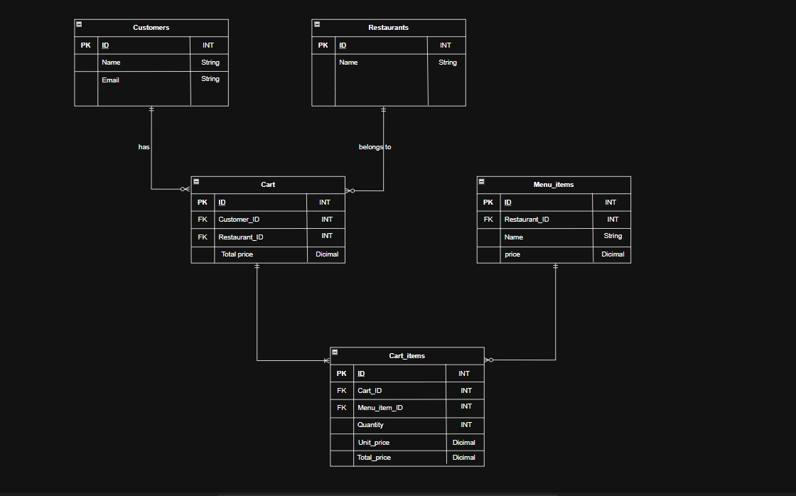
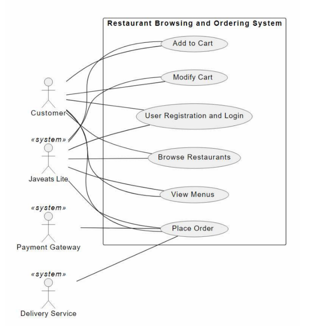

#  Javeats Lite — System Architecture & API Documentation

This repository contains the architecture, API design, use case flows, and task estimation for the **Javeats Lite** backend application.

---

## 📌 1. Database ERD
Below is the Entity Relationship Diagram (ERD) detailing the core data models for Users, Restaurants, Menu Items, Carts, Orders, and Payments.

---

## 🚀 2. API Documentation & System Use Cases

Below is the main System Use Case Diagram illustrating all core functionalities and actor interactions across the system, followed by the API endpoints documentation.

---

### 🔐 1. User Registration and Login
Manages user access control and issues session credentials.

* **Use Case Description:** User registration and authentication.
* **API Signature:** `POST /api/v1/auth/login` (or `/register`)
* **Input:** `[email, password]`
* **Output Status Code:** `200 OK` (Login) / `201 Created` (Register)
* **Workflow Explanation:** 
  Upon payload submission, the system verifies email existence and checks the encrypted password against the database. On successful authentication, a session token (JWT) is generated and returned to the client.

---

### 🏪 2. Browse Restaurants
Allows active users to explore available dining spots.

* **Use Case Description:** Browse the list of available active restaurants.
* **API Signature:** `GET /api/v1/restaurants`
* **Input:** `[page, size]` (Optional pagination)
* **Output Status Code:** `200 OK`
* **Workflow Explanation:** 
  Queries active restaurants from the database with pagination support to minimize server load, allowing optional filtering by location or cuisine type.

---

### 📜 3. View Menus
Provides menu exploration for a selected restaurant.

* **Use Case Description:** Display the menu for a specific restaurant.
* **API Signature:** `GET /api/v1/restaurants/{restaurantId}/menu`
* **Input:** `[restaurantId]`
* **Output Status Code:** `200 OK`
* **Workflow Explanation:** 
  Retrieves available menu items categorized by sections along with prices and item details specifically associated with the given `restaurantId`.

---

### 🛒 4. Add to Cart
Handles adding menu items to the cart with strict business validation.

* **Use Case Description:** Add a new item to the user's cart.
* **API Signature:** `POST /api/v1/cart/add`
* **Input:** `[cartItem, customerId]`
* **Output Status Code:** `201 Created`
* **Workflow Explanation:** 
  The system verifies that the cart does not contain items from a different restaurant (Single-Restaurant Rule). If the cart is empty or contains items from the same restaurant, the item is added; otherwise, an alert prompts the user to clear the cart first.

---

### 🧹 5. Modify / Clear Cart
Enables updating items or resetting the cart.

* **Use Case Description:** Update item quantities, remove specific items, or clear the cart completely.
* **API Signature:** `PUT /api/v1/cart/update` (or `DELETE /api/v1/cart/clear`)
* **Input:** `[cartId, customerId, cartItem]`
* **Output Status Code:** `200 OK`
* **Workflow Explanation:** 
  Allows users to adjust item quantities, remove individual items, or flush the entire cart, automatically recalculating total order costs.

---

### 📦 6. Place Order
Handles checkout, order creation, and payment processing.

* **Use Case Description:** Complete checkout and convert cart contents into a formal order.
* **API Signature:** `POST /api/v1/orders/place`
* **Input:** `[customerId, cartId, paymentDetails, deliveryAddress]`
* **Output Status Code:** `201 Created`
* **Workflow Explanation:** 
  Converts cart items into an active order with a unique tracking ID, captures a price snapshot of current item rates, initializes a payment request with a default status of `PENDING`, and clears the cart immediately.

---

## ⏱️ 3. Order & Payment Management Estimate

Below is the workload estimation table for designing and implementing the Order and Payment features:

| Task Description | Complexity | Estimated Effort |
| :--- | :---: | :---: |
| **Database Design & Relations Setup** | Medium | 4 Hours |
| **Order & Payment Entity / DTO Mapping** | Low | 3 Hours |
| **Cart to Order Conversion Logic** | Medium | 5 Hours |
| **Payment Process & Gateway Integration** | High | 10 Hours |
| **Order Status Updates & Tracking API** | Medium | 6 Hours |
| **Unit Testing & API Validation** | Medium | 5 Hours |
| **Total Estimated Effort** | | **33 Hours** |
